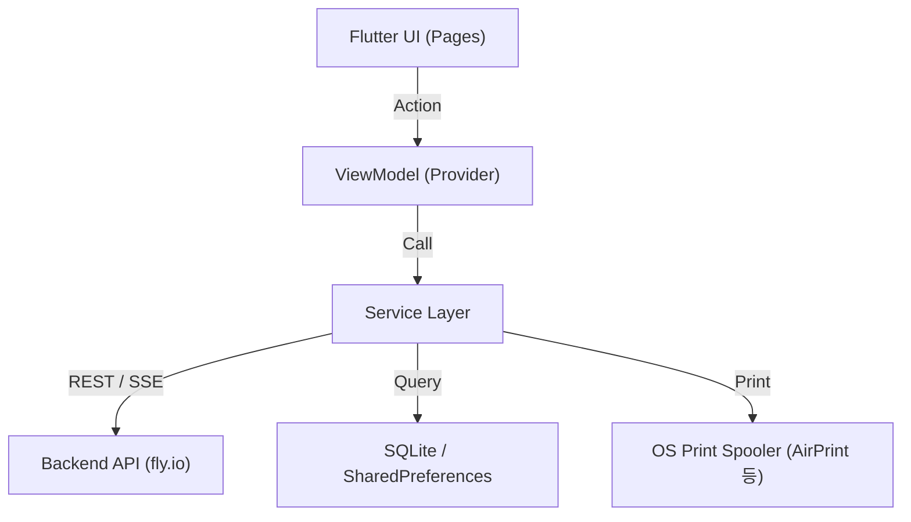

# Rusui — Provider App

가게 점주 및 직원을 위한 실시간 대기열 관리, 통계 대시보드, 티켓 출력 기능을 제공하는 모바일/데스크톱 백오피스 앱(Flutter)입니다.

## Tech Stack

| 항목 | 기술 |
|------|------|
| Framework | Flutter (Dart) |
| State | Provider (MVVM) |
| Auth | Firebase Auth |
| API / Stream | HTTP 통신, 자체 SSE 처리 |
| Database | SQLite (`sqflite`), Shared Preferences |
| Hardware | `mobile_scanner` (QR), `pdf` & `printing` (영수증) |
| Visualization | `fl_chart` (통계 그래프) |

## Getting Started

> **주의:** 보안상 `google-services.json` 및 `GoogleService-Info.plist`가 제외되어 있습니다. 실행 전 Firebase 프로젝트 연동이 필요합니다.

```bash
# 환경 변수 설정
cp .env.example .env.development
# API_URL 등을 환경에 맞게 입력

flutter pub get
flutter run
```

## Architecture

```
lib/
├── models/         → JSON 파싱용 데이터 모델
├── pages/          → 화면별 UI 및 ViewModel
├── services/       → 서버 통신 및 비즈니스 로직 (API, SSE)
├── utils/          → 헬퍼 유틸리티 (PDF 변환 등)
├── widgets/        → 공통 위젯
└── main.dart       → 앱 진입점, 전역 Provider 설정
```



→ 상세 구조: [`docs/implementation/architecture.ko.md`](./docs/implementation/architecture.ko.md)

## Documentation

구현 상세, 설계 결정, 트러블슈팅 기록은 [`docs/README.ko.md`](./docs/README.ko.md)를 참조하세요.
