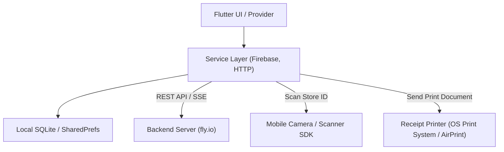

# Rusui

실시간 대기열 관리, 매출 및 대기 통계 대시보드, 티켓 인쇄 기능을 제공하는 **Rusui** 스마트 매장 관리 파트너용 크로스플랫폼(Flutter) 어플리케이션

## Screenshots
<!-- 매장용 앱의 실시간 대기열 관리, 통계 차트 대시보드, 메뉴 관리, QR 스캐너 등의 스크린샷 이미지 배치 영역 -->
| 1. 실시간 대기열 관리 | 2. 통계 대시보드 | 3. 메뉴 및 카테고리 설정 |
| :---: | :---: | :---: |
|  |  |  |

| 4. 고객용 QR 코드 발급 | 5. 매장 상세 설정 |
| :---: | :---: |
|  |  |

## Overview
**Rusui**(구 Yoyaku Mate) 파트너용 앱은 매장을 운영하는 점주 및 직원을 위한 **대기열 관리 및 매장 설정 모바일/데스크톱 백오피스 어플리케이션**입니다. 

현장에서 발생하는 고객들의 실시간 웨이팅 등록 및 호출, 대기 상태 제어, 메뉴판 정보와 직원 계정 관리, 그리고 매장 혼잡도와 대기 현황을 직관적으로 보여주는 대시보드 통계 및 감열 인쇄 시스템을 통합하여 제공합니다.

## Problem
* **현장 대기 관리의 높은 공수:** 번호표 배부, 순서 도달 시 직접 육성 호출 등으로 인해 대기 구역이 혼잡해지고 직원의 업무 효율이 저하됩니다.
* **대기 정보 통계화의 한계:** 요일별, 시간대별 혼잡도 분석이나 대기 인원 현황 데이터를 수작업으로 집계하기 어려워 과학적인 매장 운영 전략을 세우기 어렵습니다.
* **현장 노쇼(No-Show) 판별의 어려움:** 고객이 대기 장소에 실제로 도착했는지 확인하기 어려워 빈 테이블을 즉시 채우지 못하는 비효율이 발생합니다.
* **모바일 기기와 감열 프린터 연동의 복잡성:** 모바일 앱 환경에서 감열 영수증 프린터로 현장 번호표를 즉시 출력해 주는 모듈을 직접 구현하고 호환성을 확보하기가 까다롭습니다.

## Solution
* **One-tap 실시간 고객 관리 및 Push 호출:** 버튼 터치 한 번으로 대기 중인 고객에게 호출 알림을 즉시 발송하고, 대기 완료 및 취소 상태를 실시간으로 업데이트합니다.
* **fl_chart 기반 혼잡도 통계 시각화:** 대기열 히스토리를 데이터화하여 일별/주별 대기 통계 및 피크 시간대 분석 결과를 반응형 차트 대시보드로 시각화하여 매장 회전율 향상에 기여합니다.
* **매장 연동 QR 스캐너를 통한 신속한 스태프 등록:** 수동으로 복잡한 매장 ID를 타이핑하는 번거로움 없이, 기기 카메라(`mobile_scanner`)로 매장 QR을 즉시 스캔하여 빠른 매장 매핑 및 직원 연동을 지원합니다.
* **Android/iOS 호환 감열식 영수증 인쇄 연동:** `pdf` 및 `printing` 라이브러리를 통해 현장 대기 접수 즉시 프린터로 전송하여 실물 번호표 티켓을 인쇄해 줄 수 있는 시스템을 구축했습니다.
* **Firebase Auth 기반 다중 스태프 권한 관리:** 매장 내 여러 명의 직원이 각자의 계정으로 접속할 수 있도록 지원하며, 점주와 일반 직원의 권한을 분리하여 시스템 안전성을 높였습니다.

## Features
* **실시간 대기열 제어 (Queue Management):** 실시간 대기자 리스트 관리, 원클릭 호출 알림 및 입장 완료/취소 조작
* **매장 연동 QR 스캐너 (QR Code Scanner):** 스태프 가입 및 매장 추가 매핑 시 QR 코드 스캔으로 신속한 매장 연동 완료
* **메뉴 & 카테고리 관리:** 매장 식사 메뉴 및 가격의 동적 업데이트, 품절 및 카테고리 설정 지원
* **직원 관리 (Staff Management):** 다중 스태프 등록 및 역할/권한 부여 백오피스 지원
* **통계 분석 대시보드:** 기간별/시간대별 누적 대기 통계 데이터를 시각화 차트(`fl_chart`)로 리포트
* **인쇄 시스템 (Ticket Printing):** 영수증 프린터 규격에 호환되는 모바일 PDF 영수증 템플릿 설계 및 티켓 즉시 인쇄

## Tech Stack
* **Framework & Language:** Flutter (Dart)
* **State Management:** Provider
* **Authentication:** Firebase Auth
* **Database (Local):** SQLite (`sqflite`), `shared_preferences`
* **Routing:** Go Router
* **AI Engine:** Google Generative AI (Gemini SDK)
* **Hardware Integration:** `mobile_scanner`, `pdf` & `printing`
* **Visualization:** `fl_chart`

## Architecture
### 1. 디렉토리 구조
```bash
lib/
├── constants/            # API 키 정의 및 상수 모음
├── models/               # 대기열, 매장, 메뉴 등 데이터 모델 클래스
├── pages/                # 핵심 비즈니스 화면
│   ├── waiting_page/     # 실시간 대기 현황판 및 고객 호출 화면
│   ├── menu_management_page/ # 메뉴 리스트 및 세부 추가/수정 화면
│   ├── staff_management_page/ # 스태프 추가 및 역할 변경 화면
│   ├── statistics_page/  # fl_chart 기반 대시보드 통계 화면
│   ├── profile_page/     # 매장 상세 정보 및 앱 설정 화면
│   ├── store_selection/  # 관리 매장 선택 및 추가 화면
│   └── sign_up/          # 단계별 회원가입 화면
├── services/             # Firebase 및 백엔드 서버 연동 비즈니스 API 레이어
├── utils/                # PDF 변환, 시간 파싱 등 유틸리티 클래스
├── widgets/              # UI 가독성을 높이기 위해 잘게 쪼갠 공통 UI 위젯들
├── routes.dart           # GoRouter 기반 전체 앱 네비게이션 정의
└── main.dart             # Flutter 앱의 진입점 및 전역 프로바이더 설정
```

### 2. 데이터 흐름 아키텍처
매장용 앱은 로컬 데이터 캐싱 및 서비스 인프라와 결합하여 다음과 같이 구성되어 있습니다.


## Lessons Learned
* **하드웨어 연동 최적화 (카메라 및 프린터):** Android 및 iOS 기기의 내장 카메라를 활용하여 QR 코드 스캔(매장 연동용) 기능을 매끄럽게 연결하고, OS 인쇄 시스템(AirPrint 등)과 연동된 감열식 프린터를 통해 실물 대기 번호표가 누락 없이 안정적으로 출력되도록 모바일 인쇄 시스템을 연동한 경험을 쌓았습니다.
* **로컬 캐싱을 이용한 응답성 향상:** 네트워크 연결이 불안정한 식당 내부 환경에서도 원활하게 메뉴 조회가 가능하도록 SQLite를 활용한 로컬 DB 캐싱 파이프라인을 설계하여 앱의 사용성을 보장했습니다.
* **대용량 데이터 차트 드로잉 성능 개선:** `fl_chart` 위젯이 대기 통계 데이터를 실시간으로 읽고 렌더링할 때 불필요한 프레임 드롭이나 불필요한 리빌드(Rebuild)를 제어하기 위해, Provider의 Selector 패턴을 적극적으로 도입하여 메모리 소모를 최적화했습니다.

## Getting Started (시작 가이드)

> [!IMPORTANT]
> 본 프로젝트는 보안상 Firebase 및 일부 설정 파일이 `.gitignore`에 등록되어 있어 최초 클론 후 설정 파일 생성이 필요합니다.

### 1. 설정 파일 복구
1. **Firebase 설정 파일 추가**
   - Android용: `android/app/google-services.json` 파일 배치
   - iOS용: `ios/Runner/GoogleService-Info.plist` 파일 배치
   - 또는 프로젝트 루트에서 `flutterfire configure` 명령어를 실행하여 `lib/firebase_options.dart` 파일을 생성합니다.

2. **환경 변수 파일 (`.env`) 추가**
   - 프로젝트 루트 디렉토리에 `.env`, `.env.development`, `.env.production` 파일을 생성합니다.
   ```env
   # 백엔드 서버 URL 및 AI 키 설정
   API_URL=YOUR_BACKEND_API_URL
   WEB_BASE_URL=YOUR_CLIENT_WEB_URL
   GEMINI_API_KEY=YOUR_GEMINI_API_KEY
   ```

### 2. 패키지 설치 및 실행
```bash
# 의존성 패키지 설치
flutter pub get

# 앱 실행
flutter run
```
또는 VS Code / Android Studio의 디바이스 툴을 활용하여 원하는 에뮬레이터나 실기기에서 실행할 수 있습니다.
