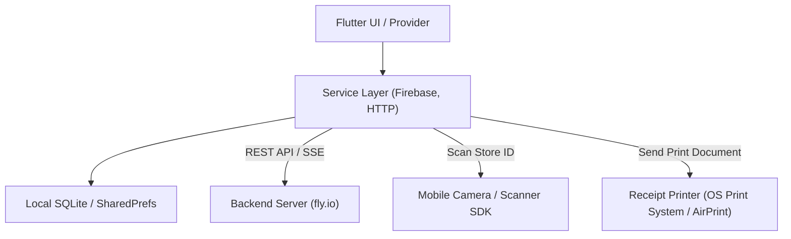

# Rusui

リアルタイムの待機列管理、売上および待機統計ダッシュボード、チケット印刷機能を提供する**Rusui**スマート店舗管理パートナー向けクロスプラットフォーム（Flutter）アプリケーション

## Screenshots
<!-- 店舗用アプリのリアルタイム待機列管理、統計グラフダッシュボード、メニュー管理、QRスキャナー等のスクリーンショット画像配置領域 -->
| 1. リアルタイム待機列管理 | 2. 統計ダッシュボード | 3. メニュー＆カテゴリ設定 |
| :---: | :---: | :---: |
|  |  |  |

| 4. お客様用QRコード発行 | 5. 店舗詳細設定 |
| :---: | :---: |
|  |  |

## Overview
**Rusui**（旧 Yoyaku Mate）パートナー用アプリは、店舗を運営する店主およびスタッフのための**待機列管理および店舗設定モバイル/デスクトップ向けバックオフィスアプリケーション**です。 

現場で発生するお客様のリアルタイムな待機登録や呼び出し、待機状態の制御、メニュー情報とスタッフアカウントの管理、そして店舗の混雑度と待機状況を直感的に表示するダッシュボード統計および感熱印刷システムを統合して提供します。

## Problem
* **店頭待機管理における人的コストの高さ:** 整理券の配布や、順番が来た際のマイク呼び出しなどによって待機スペースが混雑し、スタッフの業務効率が低下します。
* **待機情報統計化の限界:** 曜日別・時間帯別の混雑度分析や待機人数の状況データを手作業で集計するのは難しく、科学的な店舗運営戦略を立てることが困難です。
* **ノーショウ（No-Show）判定の難しさ:** お客様が実際に店舗に到着しているかどうかを確認しづらく、空いたテーブルを即時に埋めることができない非効率が発生します。
* **モバイル端末と感熱プリンター連携の複雑さ:** モバイルアプリ環境において、感熱式レシートプリンターで整理券を即時に出力するモジュールを直接実装し、互換性を確保することは非常に難易度が高い作業です。

## Solution
* **ワンタップでのリアルタイム顧客管理とPush通知による呼び出し:** ボタンをタップするだけで待機中のお客様に呼び出し通知を即時に送信し、待機完了やキャンセルステータスをリアルタイムに更新します。
* **fl_chartベースの混雑統計の可視化:** 待機列の履歴をデータ化し、日別・週別の待機統計およびピーク時間帯の分析結果をリアクティブなグラフダッシュボードとして可視化することで、店舗の回転率向上に寄与します。
* **店舗連携QRスキャナーによる迅速なスタッフ登録:** 複雑な店舗IDを手動で入力する手間を省き、端末のカメラ（`mobile_scanner`）で店舗QRをスキャンするだけで即座にスタッフ登録および店舗連携を完了します。
* **Android/iOS互換の感熱式レシート印刷連携:** `pdf`および`printing`ライブラリを介して、現場での待機受付時にプリンターへデータを送信し、実物の待機番号チケットを即座に印刷できるシステムを構築しました。
* **Firebase Authベースのマルチスタッフ権限管理:** 店舗内の複数のスタッフが個々のアカウントでログインできるようにサポートし、店主と一般スタッフの権限を分離することでシステムの安全性を高めました。

## Features
* **リアルタイム待機列制御（Queue Management）:** リアルタイムの待機者リスト管理、ワンクリックの呼び出し通知、および入場完了/キャンセル操作
* **店舗連携QRスキャナー（QR Code Scanner）:** スタッフ登録および店舗追加連携時のQRコードスキャンによる迅速な店舗連携のサポート
* **メニュー＆カテゴリ管理:** 店舗メニューや価格の動的更新、品切れおよびカテゴリ設定のサポート
* **スタッフ管理（Staff Management）:** 複数スタッフの登録および役割/権限付与のバックオフィス機能
* **統計分析ダッシュボード:** 期間別・時間帯別の累積待機統計データをグラフ（`fl_chart`）でレポート
* **印刷システム（Ticket Printing）:** レシートプリンター規格に互換性のあるモバイルPDFレシートテンプレート設計およびチケット即時印刷

## Tech Stack
* **Framework & Language:** Flutter (Dart)
* **State Management:** Provider
* **Authentication:** Firebase Auth
* **Database (Local):** SQLite (`sqflite`), `shared_preferences`
* **Routing:** Go Router
* **AI Engine:** Google Generative AI (Gemini SDK)
* **Hardware Integration:** `mobile_scanner`, `pdf` & `printing`
* **Visualization:** `fl_chart`

## Architecture
### 1. フォルダ構成
```bash
lib/
├── constants/            # APIキー定義および定数集まり
├── models/               # 待機列、店舗、メニューなどのデータモデルクラス
├── pages/                # 中核ビジネス画面
│   ├── waiting_page/     # リアルタイム待機状況板およびお客様呼び出し画面
│   ├── menu_management_page/ # メニューリストおよび詳細追加/修正画面
│   ├── staff_management_page/ # スタッフ追加および役割変更画面
│   ├── statistics_page/  # fl_chartベースのダッシュボード統計画面
│   ├── profile_page/     # 店舗詳細情報およびアプリ設定画面
│   ├── store_selection/  # 管理店舗選択および追加画面
│   └── sign_up/          # 段階別の会員登録画面
├── services/             # Firebaseおよびバックエンドサーバー連携ビジネスAPIレイヤー
├── utils/                # PDF変換、時間パースなどのユーティリティクラス
├── widgets/              # UIの可読性を高めるために細分化した共通UIウィジェット
├── routes.dart           # GoRouterベースのアプリ全体のナビゲーション定義
└── main.dart             # Flutterアプリの進入点およびグローバルプロバイダ設定
```

### 2. データフローアーキテクチャ
店舗用アプリは、ローカルデータキャッシュおよびサービスインフラと結合して以下のように構成されています。


## Lessons Learned
* **ハードウェア連携の最適化（カメラおよびプリンター）:** AndroidおよびiOS端末のカメラを利用したQRコードスキャン（店舗連携用）機能をスムーズに連携し、OS印刷システム（AirPrint等）と連動した感熱式プリンターを介して実物の待機整理券が漏れなく安定して出力されるように、モバイル印刷システムを構築した経験を得ました。
* **サーバー・クライアント間の冪等性（Idempotency）チェーン構築:** モバイル機器のネットワーク一時切断や通信遅延時に、同一の予約要求が重複送信されて待機データが二重生成される問題を防止するため、APIリクエスト送信前にクライアント側で一意な冪等キー（`waiting_id`）と登録時刻のオリジナル値を先行して生成・伝達する整合性構造を設計しました。
* **ローカルキャッシュによる応答性の向上:** ネットワーク接続が不安定な店舗内の環境においても円滑にメニュー検索が行えるよう、SQLiteを活用したローカルDBキャッシュパイプラインを設計し、アプリのユーザビリティを保証しました。
* **大容量データグラフ描画のパフォーマンス改善:** `fl_chart`ウィジェットが待機統計データをリアルタイムに読み込んでレンダリングする際、不要なフレームドロップや無駄なリビルド（Rebuild）を制御するため、ProviderのSelectorパターンを積極的に導入し、メモリ消費を最適化しました。

## Getting Started（セットアップガイド）

> [!IMPORTANT]
> 本プロジェクトはセキュリティ上、Firebaseおよび一部の設定ファイルが `.gitignore` に登録されているため、初回クローン後に設定ファイルの生成が必要です。

### 1. 設定ファイルの復旧
1. **Firebase設定ファイルの追加**
   - Android用: `android/app/google-services.json` ファイルの配置
   - iOS用: `ios/Runner/GoogleService-Info.plist` ファイルの配置
   - またはプロジェクトルートで `flutterfire configure` コマンドを実行して `lib/firebase_options.dart` ファイルを生成します。

2. **環境変数ファイル（`.env`）の追加**
   - プロジェクトルートディレクトリに `.env`、`.env.development`、`.env.production` ファイルを生成します。
   ```env
   # バックエンドサーバーのURLおよびAIキー設定
   API_URL=YOUR_BACKEND_API_URL
   WEB_BASE_URL=YOUR_CLIENT_WEB_URL
   GEMINI_API_KEY=YOUR_GEMINI_API_KEY
   ```

### 2. パッケージのインストールと起動
```bash
# 依存パッケージのインストール
flutter pub get

# アプリの起動
flutter run
```
または VS Code / Android Studio のデバイスツールを活用して、任意のシミュレータや実機で実行できます。
