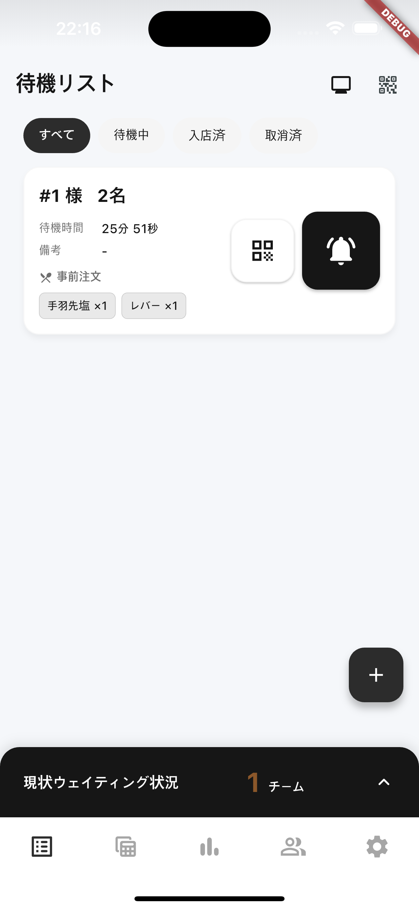
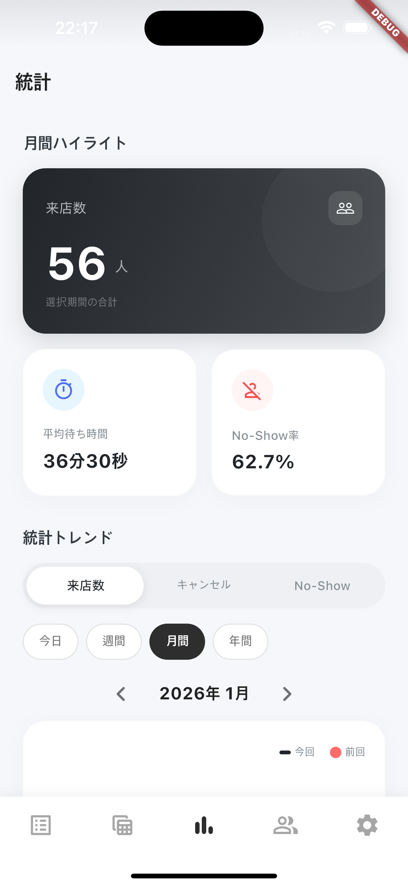
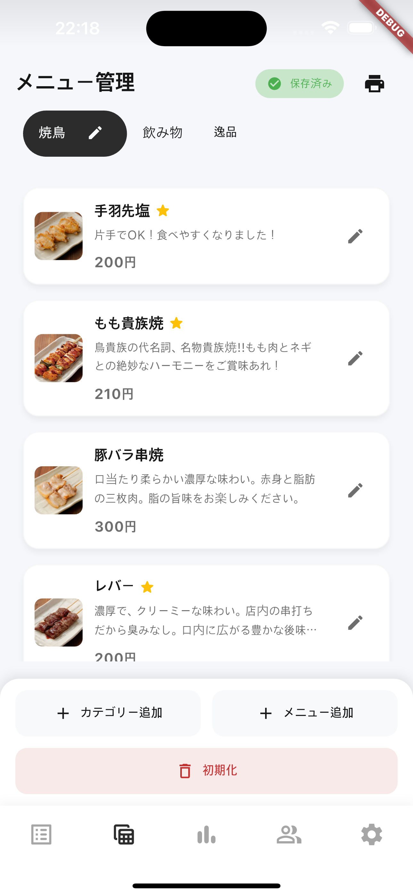
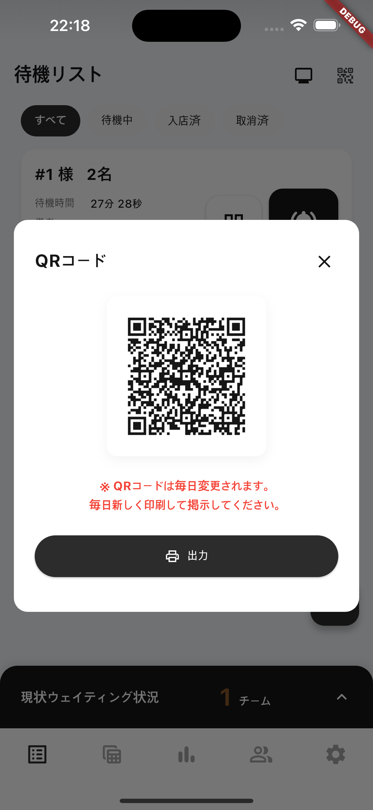
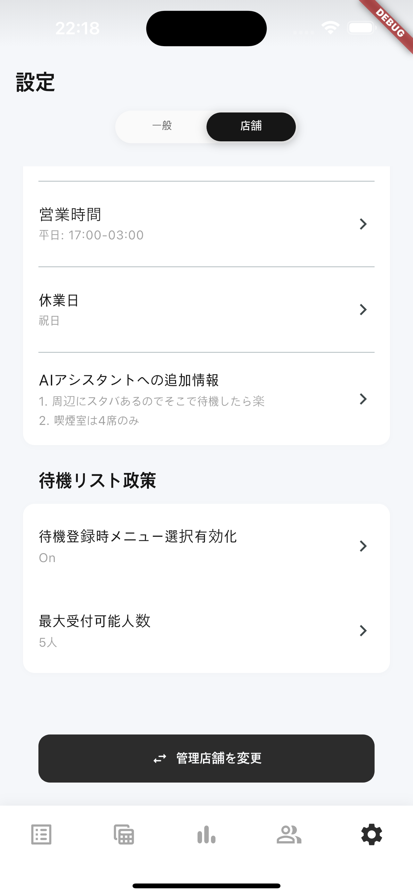
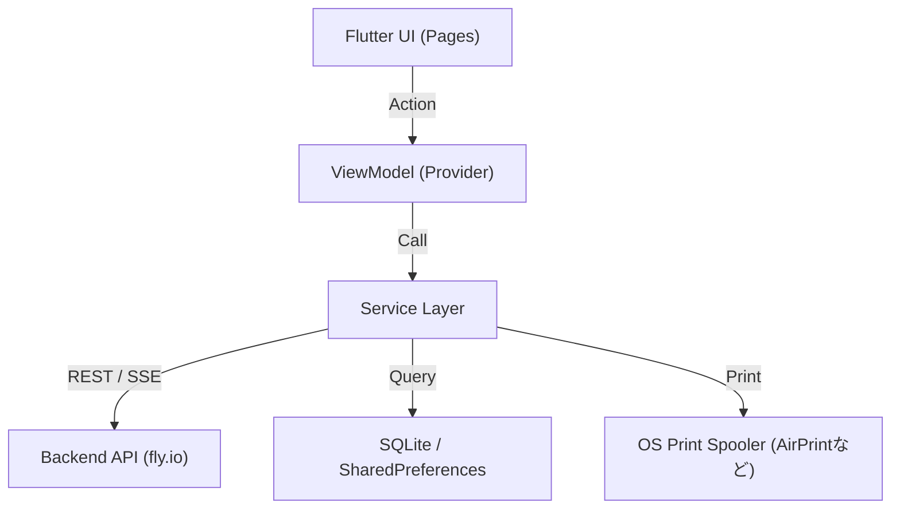

# Rusui — Provider App

店舗オーナーおよびスタッフ向けのリアルタイム待機列管理、統計ダッシュボード、チケット印刷機能を提供するモバイル/デスクトップ用バックオフィスアプリ(Flutter)です。

## Screenshots
<!-- 店舗用アプリのリアルタイム待機列管理、統計グラフダッシュボード、メニュー管理、QRスキャナー等のスクリーンショット画像配置領域 -->
| 1. リアルタイム待機列管理 | 2. 統計ダッシュボード | 3. メニュー＆カテゴリ設定 |
| :---: | :---: | :---: |
|  |  |  |

| 4. お客様用QRコード発行 | 5. 店舗詳細設定 |
| :---: | :---: |
|  |  |

## Tech Stack

| 項目 | 技術 |
|------|------|
| Framework | Flutter (Dart) |
| State | Provider (MVVM) |
| Auth | Firebase Auth |
| API / Stream | HTTP通信、独自SSE処理 |
| Database | SQLite (`sqflite`), Shared Preferences |
| Hardware | `mobile_scanner` (QR), `pdf` & `printing` (整理券) |
| Visualization | `fl_chart` (統計グラフ) |

## Getting Started

> **注意:** セキュリティ上、 `google-services.json` および `GoogleService-Info.plist` は除外されています。実行前にFirebaseプロジェクトの連携が必要です。

```bash
# 環境変数の設定
cp .env.example .env.development
# API_URLなどを環境に合わせて入力

flutter pub get
flutter run
```

## Architecture

```
lib/
├── models/         → JSONパース用データモデル
├── pages/          → 画面別UIおよびViewModel
├── services/       → サーバー通信およびビジネスロジック (API, SSE)
├── utils/          → ヘルパーユーティリティ (PDF変換など)
├── widgets/        → 共通ウィジェット
└── main.dart       → アプリエントリーポイント、グローバルProvider設定
```



→ 詳細構造: [`docs/implementation/architecture.md`](./docs/implementation/architecture.md)

## Documentation

実装の詳細、設計決定、トラブルシューティングの記録は、 [`docs/`](./docs/README.md) を参照してください。
